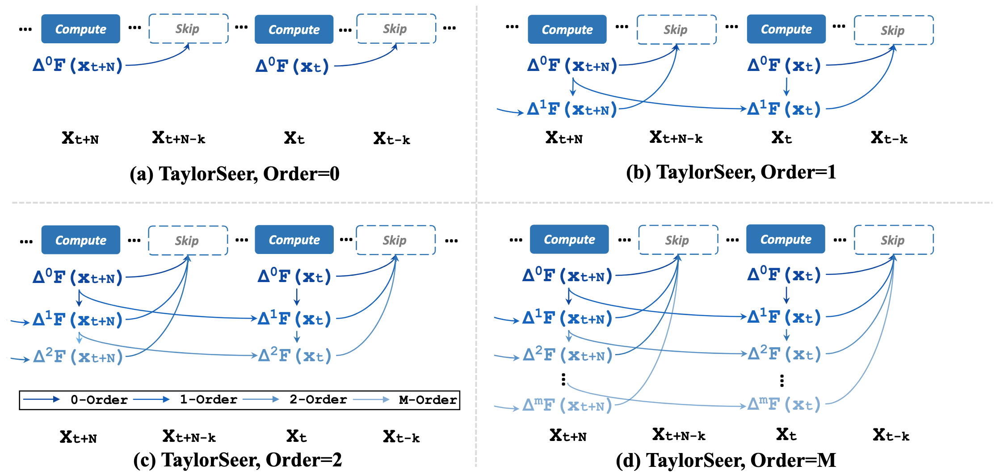
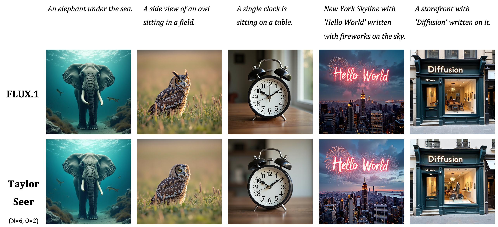

# From Reusing to Forecasting: Accelerating Diffusion Models with TaylorSeers

Here, We provide a highly readable and easy-to-use implementation of TaylorSeer, an awesome, efficient generation paradigm with *cache-then-forecast* mechanism.

## ✨Introduction

> **Abstract**: Diffusion Transformers (DiT) have revolutionized high-fidelity image and video synthesis, yet their computational demands remain prohibitive for real-time applications. To solve this problem, feature caching has been proposed to accelerate diffusion models by caching the features in the previous timesteps and then reusing them in the following timesteps. However, at timesteps with significant intervals, the feature similarity in diffusion models decreases substantially, leading to a pronounced increase in errors introduced by feature caching, significantly harming the generation quality. To solve this problem, we propose TaylorSeer, which firstly shows that features of diffusion models at future timesteps can be predicted based on their values at previous timesteps. Based on the fact that features change slowly and continuously across timesteps, TaylorSeer employs a differential method to approximate the higher-order derivatives of features and predict features in future timesteps with Taylor series expansion. Extensive experiments demonstrate its significant effectiveness in both image and video synthesis, especially in high acceleration ratios. For instance, it achieves an almost lossless acceleration of 4.99 $\times$ on FLUX and 5.00 $\times$ on HunyuanVideo without additional training. On DiT, it achieves 3.41 lower FID compared with previous SOTA at 4.53 $\times$ acceleration. Our code is provided in the supplementary materials and will be made publicly available on GitHub. Our codes have been released in Github:https://github.com/Shenyi-Z/TaylorSeer



## 📋TODO List

- [x] Initialize this project.
- [x] Implement core algorithm of TaylorSeer.
- [x] Provide inference demos with TaylorSeer acceleration.
- [ ] Support evaluation for image and video models.
- [ ] Integrate TaylorSeer into more visual generation models.


## 📦Installation

In this project, we use [uv](https://github.com/astral-sh/uv) for package management.

1. **Clone this repository and navigate to the TaylorSeer folder:**

```
git clone https://github.com/Aporifold/TaylorSeer.git
cd TaylorSeer
```

2. **Install the inference package:**

```
uv sync
```

3. **(Optional) Install the benchmark extra dependencies**, required only for `scripts/benchmark.py`:

```
uv sync --extra eval
```

## 🚀Quickstart

The current implementation of TaylorSeer is easy to use and works out of the box. Just wrap the pipeline's cacheable submodules of `diffusers` via an adapter, then monkey-patch them through a `CacheManager` within a `with` block:

```python
from diffusers import FluxPipeline
from taylorseer import CacheManager, FluxAdapter, TaylorSeerConfig

pipe = FluxPipeline.from_pretrained(
    "black-forest-labs/FLUX.1-dev",
    torch_dtype=torch.bfloat16
).to("cuda")

config = TaylorSeerConfig(order=2, interval=4, warmup_steps=1)
manager = CacheManager(config)

with FluxAdapter().patch(pipe, manager):
    image = pipe("A cat holding a sign that says hello world").images[0]
```

- `order`: max order of the Taylor expansion used to predict skipped steps (`0` = naive feature reuse).
- `interval`: number of steps between two full-compute (activation) steps.
- `warmup_steps`: number of steps at the start of denoising that are always full-compute.

Exiting the `with` block restores the pipeline's original `forward` methods, so the same `pipe` can be reused with or without acceleration.

## 🔌Adapters

Currently, we support 4 adapters: *DiT*, *FLUX*, *Wan2.1*, and *HunyuanVideo*, with each adapter targets one model family. Inference demos can be found in `playground/`. Here is an running example:

```
python playground/flux.py \
    --prompt "a fox in a forest" \
    --enable_taylorseer \
    --order 2 \
    --interval 4 \
    --warmup_steps 1
```

## 📊Evaluation

Currently, we support FLUX.1-dev model evaluation, comparing base model against TaylorSeer on [DrawBench](https://docs.google.com/spreadsheets/d/1y7nAbmR4FREi6npB1u-Bo3GFdwdOPYJc617rBOxIRHY/edit?gid=0#gid=0). Here is an evaluation example:

```
CUDA_DEVICES=0,1 ./scripts/run_bench.sh \
    --model_path black-forest-labs/FLUX.1-dev \
    --data_path data/drawbench.jsonl \
    --order 2 --interval 4 --warmup_steps 3 \
    --num_inference_steps 50 \
    --output_dir outputs
```


## 🎨Visualizations



Above are several examples of qualitative comparison between the baseline and TaylorSeer (N=6, O=2) on the FLUX.1-dev model.

## 👏Acknowledgement

This project is built upon the official implementation of [TaylorSeer](https://github.com/Shenyi-Z/TaylorSeer) and [diffusers](https://github.com/huggingface/diffusers). Thanks for their excellent work!
